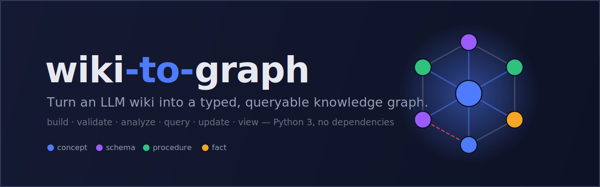
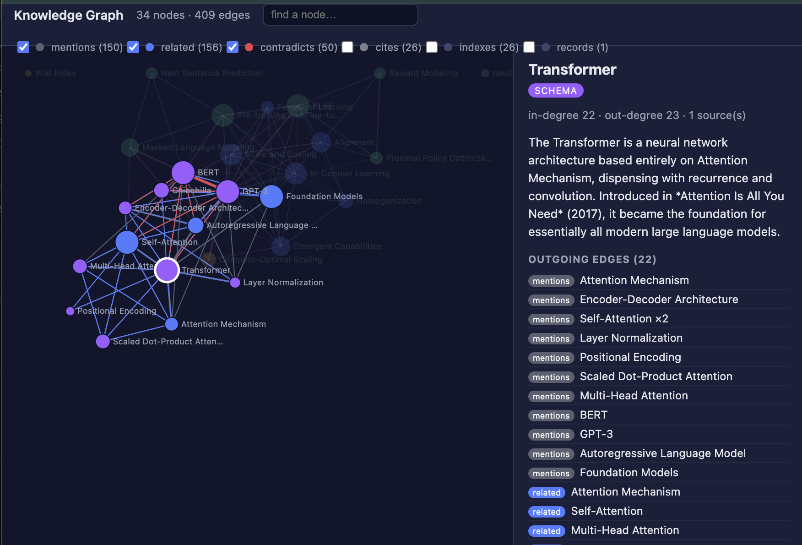

<p align="center">
  
</p>

<h1 align="center">wiki-to-graph</h1>

<p align="center">
  
  
  
  
  
</p>

Turn an **LLM wiki** — a folder of interlinked markdown pages (the ["LLM wiki"
pattern by Andrej Karpathy](https://datasciencedojo.com/blog/llm-wiki-tutorial/)) —
into a real **knowledge graph**: typed nodes and edges you can validate, analyze, traverse, query,
update, and view in a browser. Python 3 only; no other dependencies.

The insight: an LLM wiki is *already* a graph — pages are nodes, `[[wiki-links]]` are edges. Each
page's consistent sections tell you what *kind* of edge each link is (a link under `## Related` is a
`related` edge; one under `## Contradictions` is `contradicts`). This tool makes that graph explicit.



*The included graph viewer (`graph-viewer.html`): nodes colored by kind, edges by type; click any
node to read its summary and walk its edges.*

---

## This is a Claude plugin

```
wiki-to-graph/                      ← plugin root (also a one-plugin marketplace)
├── .claude-plugin/
│   ├── plugin.json                 ← plugin manifest
│   └── marketplace.json            ← lets the repo be added as a marketplace
├── skills/
│   └── wiki-to-graph/
│       ├── SKILL.md                ← the skill (build/validate/analyze/query/update/view)
│       ├── references/spec.md      ← full ontology + format spec
│       └── scripts/
│           ├── wiki_to_graph.py       ← the toolkit
│           └── build_graph_viewer.py   ← HTML graph viewer generator
├── examples/llm-wiki/              ← the runnable example wiki (source of build/)
│   ├── wiki/                       ← 28 markdown pages (the LLM wiki)
│   └── raw/                        ← 6 source papers the pages cite
├── build/                          ← sample outputs, regenerated from examples/llm-wiki/wiki
├── docs/outputs-and-workflows.md   ← what each build object is + example workflows
├── assets/graph-viewer.png
├── LICENSE.md
└── README.md
```

**Runnable example included.** `examples/llm-wiki/` is the exact wiki the
committed `build/` artifacts were generated from, so the whole pipeline runs
from a fresh clone. New here? Start with
[`docs/outputs-and-workflows.md`](docs/outputs-and-workflows.md).

### Install

- **As a plugin (Cowork):** open the delivered `wiki-to-graph.plugin` file and click install; or
  Settings → Capabilities → add plugin.
- **As a marketplace / skill repo:** push this folder to a git repo and add it as a plugin
  marketplace (`.claude-plugin/marketplace.json` lists the plugin). Claude Code:
  `/plugin marketplace add <repo-url>` then `/plugin install wiki-to-graph`.
- **No install needed:** the scripts are plain Python — just run them (below).

Requirements: Python 3 (standard library only). `networkx`/`scipy` are optional, for your own
heavier analysis.

---

## Quick start

Paths below are from the plugin root. (`SCR=skills/wiki-to-graph/scripts`)

### 1 · Build the graph

```bash
python3 skills/wiki-to-graph/scripts/wiki_to_graph.py build examples/llm-wiki/wiki \
        -o build/graph.json --emit sqlite,graphml
```

Writes **`build/graph.json`** (canonical), plus `graph.db` (SQLite) and `graph.graphml` (Gephi/yEd).
Add `--kspace` for a `domain.json` KST projection.

### 2 · Validate

```bash
python3 skills/wiki-to-graph/scripts/wiki_to_graph.py validate build/graph.json
```

Broken links / orphans / self-loops fail (exit 1). Cross-reference cycles are informational.

### 3 · Analyze

```bash
python3 skills/wiki-to-graph/scripts/wiki_to_graph.py analyze build/graph.json --top 5
```

PageRank, in-degree, most-contested nodes, components, communities. Shortest path:
`--path "GPT-3" "Layer Normalization"`.

### 4 · Query (no SQL needed)

```bash
SCR=skills/wiki-to-graph/scripts/wiki_to_graph.py
python3 $SCR query build/graph.json node "RLHF"            # details + edges
python3 $SCR query build/graph.json neighbors "GPT-3"      # outgoing
python3 $SCR query build/graph.json backlinks "Transformer"# incoming
python3 $SCR query build/graph.json contradicts            # all tension pairs
python3 $SCR query build/graph.json bfs "Transformer" --edges related
python3 $SCR query build/graph.json dfs "GPT-3" --edges contradicts --undirected
python3 $SCR query build/graph.json path "Positional Encoding" "RLHF"
```

**Filter any traversal** on edge type, node type/kind, or a combination — include or exclude:

| flag | effect |
|------|--------|
| `--edges a,b` | traverse/show ONLY these edge types |
| `--ignore-edges x,y` | all edge types EXCEPT these |
| `--kind a,b` | visit ONLY these node kinds (`concept/schema/procedure/fact`) |
| `--ignore-kind x,y` | all kinds EXCEPT these |
| `--node-type …` / `--ignore-node-type …` | filter structural type (`concept/source/index/log`) |
| `--undirected` | treat edges as undirected in bfs/dfs |

### 5 · Update the wiki, then rebuild

The graph is derived; edit the source markdown and re-run `build`.

```bash
python3 $SCR update examples/llm-wiki/wiki add-node --title "Mixture of Experts" --kind schema --summary "…"
python3 $SCR update examples/llm-wiki/wiki add-edge --from "Mixture of Experts" --to "Transformer" --type related
python3 $SCR update examples/llm-wiki/wiki set-kind --node "GPT-3" --kind schema
```

### 6 · View in a browser

```bash
python3 skills/wiki-to-graph/scripts/build_graph_viewer.py build/graph.json -o build/graph-viewer.html
```

Double-click `build/graph-viewer.html` (offline, no dependencies).

---

## The model in 30 seconds

- **Nodes** have a structural `type` (`concept`, `source`, `index`, `log`); concepts also carry a
  knowledge `kind`: **concept / schema / procedure / fact** (set per page via frontmatter `kind:`).
- **Edges** are typed by their source section: `mentions`, `related`, `contradicts`, `cites`, plus
  `indexes` / `records` from the index/log hub pages.
- Each node carries its own `edges` list, degrees, `word_count`, `n_sources`, `aliases`. Link text
  is stored as plain names — the relationship lives in the edge, not in `[[markup]]`.

Full details: `skills/wiki-to-graph/references/spec.md`.

## Use on your own wiki

One concept per page, consistent `##` sections, `[[Page Title]]` links, optional `kind:`
frontmatter. Different section names? Pass `--map map.json` to `build`.

## License

Licensed under [Creative Commons Attribution-NonCommercial-ShareAlike 4.0
International (CC BY-NC-SA 4.0)](https://creativecommons.org/licenses/by-nc-sa/4.0/).
Free to use, share, and adapt for **non-commercial** purposes, with attribution,
under the same license. Commercial use is not permitted under this license.

**Commercial users should inquire for use:** contact **tim.darrah@mangrove.ai**.

Full terms in [`LICENSE.md`](LICENSE.md).

## Status & limits

Working end-to-end: build → validate → analyze → query → update → view. Deliberately simple and
static — the graph is recomputed from the markdown on every `build` (no incremental updates). Edge
`weight` is captured but inert (not used by metrics). Not yet aligned to any external ontology.

## Acknowledgements

- The **"LLM wiki" pattern** is due to **Andrej Karpathy**.
- The bundled example (`examples/llm-wiki/`) follows Data Science Dojo's tutorial,
  [*The LLM Wiki Pattern by Andrej Karpathy: A Step-by-Step Tutorial to Building a
  Compounding Knowledge Base*](https://datasciencedojo.com/blog/llm-wiki-tutorial/),
  and is compiled from six foundational AI papers (Attention Is All You Need, BERT,
  GPT-3, Foundation Models, RLHF/InstructGPT, Chinchilla).
